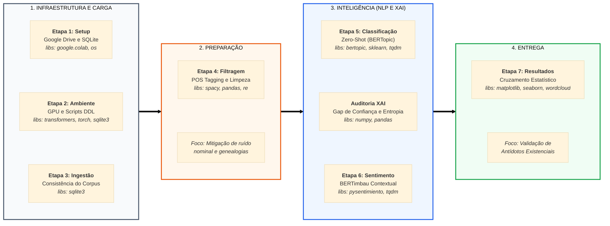

# 📖 Arquiteturas Transformers e Aprendizado Zero-Shot na Classificação de Eixos Existenciais no Texto Bíblico


Este projeto de Trabalho de Conclusão de Curso (MBA em Engenharia de Software) utiliza técnicas de **Processamento de Linguagem Natural (PLN)** para analisar o texto bíblico (NVI) sob a ótica da psicologia existencial e sociologia contemporânea.

O objetivo é identificar "antídotos" nas escrituras para as angústias descritas por:
* **Viktor Frankl:** O vazio existencial e a busca de sentido.
* **Zygmunt Bauman:** A fragilidade dos laços e a incerteza da modernidade líquida.
* **Byung-Chul Han:** A exaustão e a fadiga na sociedade do desempenho.

---

## 🛠️ Arquitetura de Dados e Tecnologias

Diferente de abordagens puramente estatísticas, este projeto implementa uma arquitetura que integra modelos de linguagem de larga escala com camadas de regras de negócio:

* **IA Explicável (XAI):** Auditoria via entropia e similaridade cosseno para validar a confiança das classificações.
* **Thresholds de Especialista:** Implementação de limiares de decisão para mitigar o ruído em textos de alta concisão ou polissêmicos.
* **Modelagem Zero-Shot:** Classificação de eixos existenciais sem necessidade de treinamento prévio rotulado, utilizando `BERTopic`.
* **Análise de Sentimento:** Uso do modelo `BERTimbau` para capturar a polaridade afetiva no português brasileiro.

### 🗄️ Modelagem do Banco de Dados
O sistema utiliza **SQLite** para garantir a rastreabilidade total, desde o metadado do versículo até o *gap* de confiança da predição.

Para detalhes sobre as tabelas, tipos de dados e o **Diagrama de Entidade-Relacionamento (ER)** renderizado via Mermaid, acesse:
👉 **[Documentação da Arquitetura de Dados (database.md)](docs/database.md)**

---

## 🎓 Etapas do Processamento



---

## 📂 Estrutura do Repositório

```text
├── data/                            # Banco de dados .db (git-ignored).
│   ├── base-dados-final.db          # Versão final da base de dados, completa.
├── docs/
│   ├── database.md                  # Documentação técnica e diagrama do modelo de dados.
├── notebooks/
│   ├── 01-processamento_pln.ipynb   # Pipeline de limpeza, BERTopic e Sentimento.
│   └── 02-visualizacao_resultados.ipynb # Extração de insights e visualização de dados.
│   └── 03-geracao-fluxos-dados.ipynb # Apoio à geração de imagens 
├── sql/
│   └── queries/
│       └── 01-dados-graficos.sql    # Consultas SQL para geração dos gráficos.
│       └── 02-validacoes.sql        # Consultas SQL para auditoria dos resultados.
│   ├── 01-schema.sql                # Definição de todas as tabelas e índices.
│   ├── 02-seed_data.sql             # População do texto bíblico e metadados.
└── README.md                        # Documentação do projeto.
```

---

## 🎓 Autoria
* **Heber Davi Salcedo Rodrigues** - *Especialista em Engenharia de Software*
* **Orientador:** Prof. Dr. Orlando Da Silva Junior
